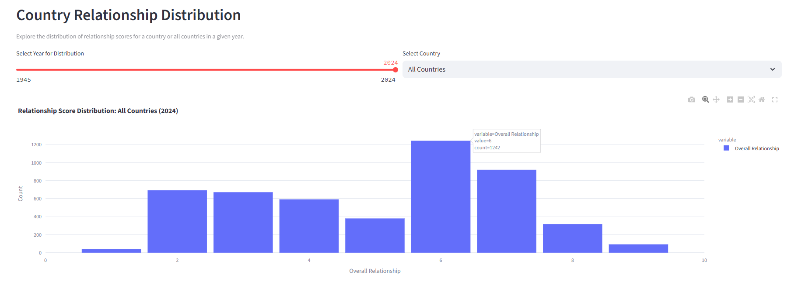
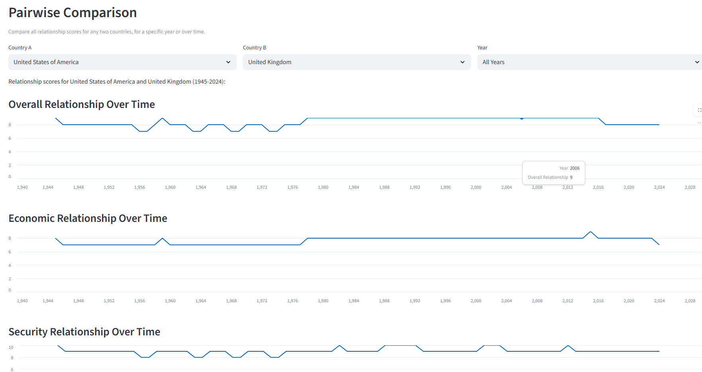

# Bilateral Relationship Visualization

This Streamlit app visualizes bilateral relationship scores between 100 countries from 1945 to 2024. It supports interactive heatmaps, network graphs, pairwise comparisons, and more.

## Features

- Heatmap of country-to-country relationships (overall, economic, political, security, cultural)
- Interactive tooltips and details on hover/click
- Year slider to explore changes over time
- Top-N strongest/weakest relationships
- Country relationship distribution (histogram, boxplot, summary stats)
- Country-to-network graph
- Pairwise comparison (table and line charts)
- Modular, efficient, and optimized for performance

## Screenshots







## Data

- `data/overall.csv`: Main dataset. Columns: `year`, `country1`, `country2`, `overall`, `economic`, `political`, `security`, `cultural`
- `data/countries.txt`: List of country names (one per line)

## Getting Started

### 1. Clone the repository

```bash
git clone https://github.com/mlucifer27/bilateral-visualization.git
cd bilateral-visualization
```

### 2. Install dependencies

It is recommended to use a virtual environment.

```bash
pip install -r requirements.txt
```

### 3. Run the app

```bash
streamlit run app.py
```

The app will open in your browser at `http://localhost:8501`.

## Deployment

### Streamlit Community Cloud

1. Push your code (including data files) to GitHub.
2. Go to [https://streamlit.io/cloud](https://streamlit.io/cloud) and sign in with GitHub.
3. Click "New app", select your repo, branch, and `app.py`.
4. Click "Deploy". Your app will be live at a public URL.

### Notes

- Ensure `data/overall.csv` and `data/countries.txt` are present in the repo for deployment.
- For large/private data, consider using cloud storage and loading data at runtime.
- For secrets, use Streamlit's [secrets management](https://docs.streamlit.io/streamlit-community-cloud/deploy-your-app/secrets-management).

## Customization

- All key parameters (year range, colormap, figure size, etc.) are modularized in the code for easy adjustment.
- The app is structured for easy extension and optimization.

## License

MIT
